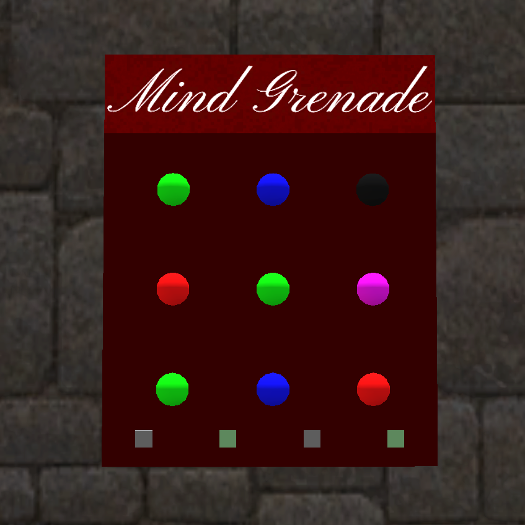

# Fourmilab Mind Grenade

[Fourmilab Mind Grenade](https://marketplace.secondlife.com/p/Fourmilab-Mind-Grenade/18005548)
is a model of the Mind Grenade random music generator for the
[Second Life](https://en.wikipedia.org/wiki/Second_Life) virtual world.

The Mind Grenade uses a linear-feedback shift register to generate 
pseudorandom music which is played at a given tempo (notes per second). 
The shift register is 31 bits in length, which provides a sequence of 
sufficient length that with the default tempo of four notes per second 
the tune will not repeat for over 17 years.  Nine lights show the state 
of the least significant bits of the shift register (the original 
[hardware Mind Grenade](https://www.fourmilab.ch/webtools/MindGrenade/)
used a 9-bit register) and can display in either 
colour (based on a three bit history for each cell in the shift 
register) or monochrome (showing only the current state of each bit).

This repository contains all of the software and resources,
including programs in Linden Scripting Language, sound
clips, notecards, and development documentation, tools,
and resources used the model and its development.  The actual
model is built within Second Life and these components are
installed within it.

The
[complete model](https://marketplace.secondlife.com/p/Fourmilab-Mind-Grenade/18005548)
is available for free in the Second Life Marketplace.  This
repository contains everything in the model (except the prims,
which are objects built within Second Life), plus additional
resources for developers who may wish to extend or adapt the
model as they wish.  The model is delivered with "full permissions":
those who obtain it are free to copy, modify, and transfer it to
other users within Second Life.

All of this software is licensed under the Creative Commons
Attribution-ShareAlike license.  Please see LICENSE.md in this
repository for details.
